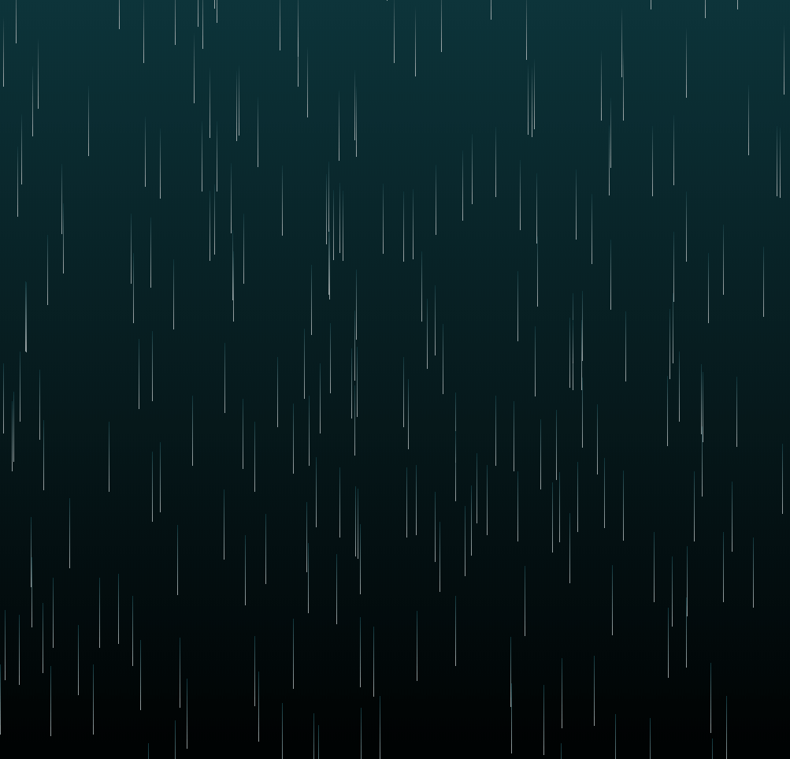

# JavaScript Animation

JavaScript with CSS rain effect animation.

All the credits goes to this [YouTube tutorial](https://www.youtube.com/watch?v=ni2Sm_j-PjU).

## References

  - [Create a Rain Effect in HTML 5 with Javascript and CSS](https://www.youtube.com/watch?v=ni2Sm_j-PjU).
