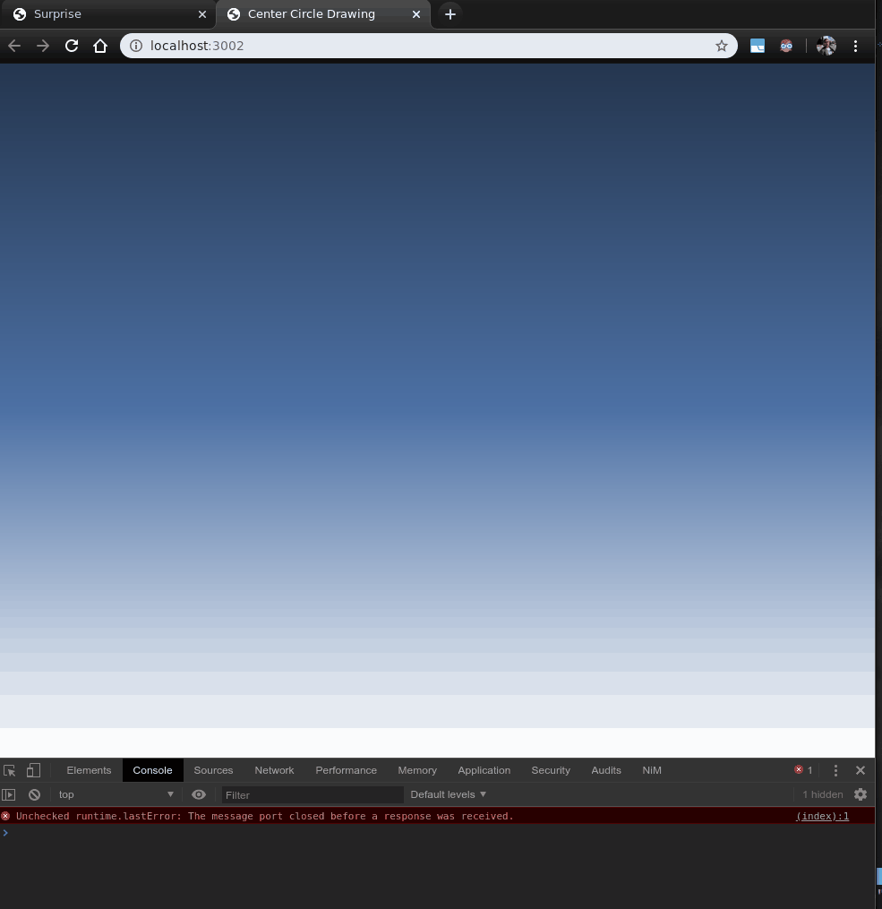

# Center Circle Particle Animation

Creates randomly generated particles in html canvas that bubbles on `mousemove`
event. Also restrict movement and size of particles within resizable unit circle
adjusted from the center.

## References

  - [HTML Canvas & Vanilla JavaScript Animation Series 2 - Animated Clouds Effect](https://www.youtube.com/watch?v=hF-QBhDG-wE)
  - [Euclidean distance formula](https://en.wikipedia.org/wiki/Euclidean_distance)
